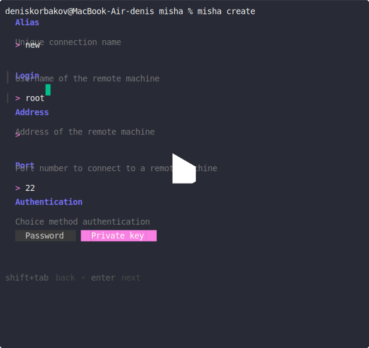

<p align="center">
  
</p>

# Misha - tui ssh client


[](https://wakatime.com/badge/user/018b9f7a-8548-4f9d-9ebe-df3058a5bab7/project/0ba8ca36-0853-4f1a-b172-2754bd298ded)

Misha - SSH client made on go

Made using data from packages:

* [cobra](https://github.com/spf13/cobra)
* [fang](http://github.com/charmbracelet/fang)
* [huh](https://github.com/charmbracelet/huh)

## ✨ Install

Install using homebrew:

```bash
# macOS or Linux
brew install misha-ssh/tap/misha
```

>If you get an error - ``git-credential-osxkeychain wants to access key``
then you can refuse to provide access and continue downloading

You can also install the package from the release via the [link](https://github.com/misha-ssh/cli/releases)

## 📖 Examples & Usage

The list of commands that you can use in this SSH client

### 🔌 Connect

The command to connect to the remote server

[](https://asciinema.org/a/734047)

### 📥 Copy

The command to upload | download files

[](https://asciinema.org/a/745884)

### ✍️ Create

The command to create a connection

[](https://asciinema.org/a/734430)

### 🪄 Update

The command to update the connection

[](https://asciinema.org/a/734431)

### 🆑 Delete

The command to delete the connection

[](https://asciinema.org/a/734051)

## ⌨️ Local Run

The command to build app:

```bash
make build
```

Run bin file for run app:

```bash
./misha
```

## 🧪 Testing

The command to launch the linter:

```bash
make lint
```

## 🤝 Feedback

We appreciate your support and look forward to making our product even better with your help!

[@Denis Korbakov](https://github.com/deniskorbakov)
